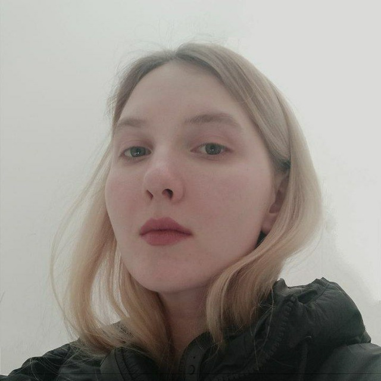

# Надежда Соломенникова 
## Фронтенд-разработчик     

### **Немного обо мне:** 
***
 Мне 16 лет, я живу в Минске, учусь в Академии связи, и параллельно прохожу курсы по фронтенд-разработке от IT-школы MyFreedom. Я уже изучила HTML и CSS, сейчас изучаю ЯП js и другие тонкости сферы программирования. 
Что касается софт-скилов, я достаточно общительный, коммуникабельный человек, умею работать в команде, стрессоустойчивая.

### **Мои скилы:** 
***
- HTML
- CSS, SCSS
- JS
- Английский язык (B1)
- Figma

### **Мои контакты:** 
***
- [Telegram](https://t.me/soplya)
- Тел.: +375 33 945 68 37